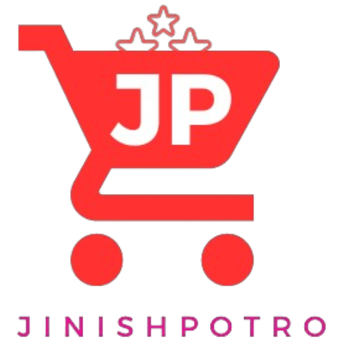

# [ JinishPotro](https://jinishpotro.netlify.app/) Backend

## Entity Relationship Diagram


- [Link to the ER Diagram](https://drive.google.com/file/d/1X5xBuUGsqvhzn6WYZaxs2fCkfxbLh8ce/view?usp=sharing)

# JinishPotro Backend Overview

JinishPotro Backend serves as the foundational component for the JinishPotro full-stack MERN website. This robust backend is built using Node.js and Express.js, employing the Mongoose library for seamless interaction with MongoDB. The backend provides essential functionalities for user authentication, category and product management, review handling, and order processing.

## Key Features

### User Authentication

- Secure user authentication mechanisms through JSON Web Tokens (JWT).
- User management routes for retrieval, modification, and deletion.

### Category & Product Management

- Efficient handling of product categories with endpoints for retrieval, creation, and deletion.
- Product management capabilities, including creation, retrieval, and deletion, with integrated review functionalities.

### Reviews

- Robust review system allowing users to provide feedback and ratings for products.
- Flexible review management routes for addition and deletion.

### Order Processing

- Streamlined order creation and management with dedicated routes for creation, retrieval, update, and deletion.

# API's

- User Authentication

  - /api/v1/user (GET)
  - /api/v1/user/:id (GET)
  - /api/v1/login (POST)
  - /api/v1/signup (POST)
  - /api/v1/user/update/admin/:id (PUT)
  - /api/v1/user/update/to/user/:id (PUT)
  - /api/v1/user/delete/:id (DELETE)

- Categoriy & Product Routes

  - /api/v1/categoriy (GET)
  - /api/v1/categoriy/:id (GET Single)
  - /api/v1/categoriy (POST)
  - /api/v1/categoriy/product (PUT)
  - /api/v1/categoriy/:categoryId/product/:productId
  - /api/v1/categoriy/:id (DELETE)
  - /api/v1/categoriy/:categoryId/products/:productId (DELETE)
  - /api/v1/categoriy/:categoriyId/products/:productId/review/:reviewId (DELETE)

- Review

  - /api/v1/categoriy/product/review (PUT)
  - /api/v1/categoriy/:categoriyId/products/:productId/review/:reviewId (DELETE)

- Order
  - /api/v1/order/create (POST)
  - /api/v1/order/ (GET)
  - /api/v1/order/:id (DELETE)
  - /api/v1/order/update/:id (PATCH)

## Demo Data

- Categoriy

  - /api/v1/categoriy (POST)

  ```
    {
    "name": "categoriy 1",
    "title": "categoriy 1 Title",
    "detail": "categoriy 1 Details",
    "photo": "categoriy1.jpg"
    }
  ```

- product
  - /api/v1/categoriy/product (PUT)

```
    {
    "categoriyId": "Categoriy ID Here",
    "name": "product 1",
    "detail": "product 1 Details",
    "sellerName": "TH Raju",
    "sellerId": "seller Id",
    "photo": "product.jpg",
    "price": 200,
    "discount": 5,
    "review": []
    }
```

- Review
  - /api/v1/categoriy/product/review (PUT)

```
    {
    "categoriyId": "Categoriy Id",
    "productId": "Review Id",
    "reviewData" : {
        "user": "Th Raju",
        "userId": "User Id",
        "comment": "User Comment",
        "rating": 5
        }
    }
```

## License

This project is licensed under [TH-Raju](https://tofajjol-hosen-raju.web.app/).

## Contact

For inquiries, reach out to me at [rajukhan894200@gmail.com]().

---


<p align="center">
  
  <strong>Happy Shopping with JinishPotro!</strong>
</p>
