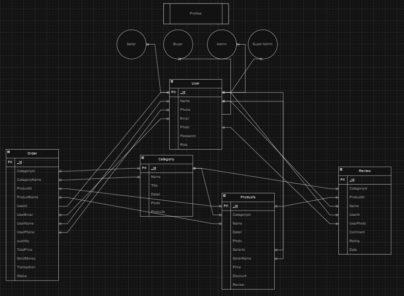

# JinishPotro Backend

## Entity Relationship Diagram

- [Link of ER Diagram](https://drive.google.com/file/d/1X5xBuUGsqvhzn6WYZaxs2fCkfxbLh8ce/view?usp=sharing)



# API's

- User Authentication

  - /api/v1/user (GET)
  - /api/v1/user/:id (GET)
  - /api/v1/login (POST)
  - /api/v1/signup (POST)
  - /api/v1/user/update/admin/:id (PUT)
  - /api/v1/user/update/to/user/:id (PUT)
  - /api/v1/user/delete/:id (DELETE)

- Categoriy & Product Routes

  - /api/v1/categoriy (GET)
  - /api/v1/categoriy/:id (GET Single)
  - /api/v1/categoriy (POST)
  - /api/v1/categoriy/product (PUT)
  - /api/v1/categoriy/:categoryId/product/:productId
  - /api/v1/categoriy/:id (DELETE)
  - /api/v1/categoriy/:categoryId/products/:productId (DELETE)
  - /api/v1/categoriy/:categoriyId/products/:productId/review/:reviewId (DELETE)

- Review

  - /api/v1/categoriy/product/review (PUT)
  - /api/v1/categoriy/:categoriyId/products/:productId/review/:reviewId (DELETE)

- Order
  - /api/v1/order/create (POST)
  - /api/v1/order/ (GET)
  - /api/v1/order/:id (DELETE)
  - /api/v1/order/update/:id (PATCH)

## Demo Data

- Categoriy

  - /api/v1/categoriy (POST)

  ```
    {
    "name": "categoriy 1",
    "title": "categoriy 1 Title",
    "detail": "categoriy 1 Details",
    "photo": "categoriy1.jpg"
    }
  ```

- product
  - /api/v1/categoriy/product (PUT)

```
    {
    "categoriyId": "Categoriy ID Here",
    "name": "product 1",
    "detail": "product 1 Details",
    "sellerName": "TH Raju",
    "sellerId": "seller Id",
    "photo": "product.jpg",
    "price": 200,
    "discount": 5,
    "review": []
    }
```

- Review
  - /api/v1/categoriy/product/review (PUT)

```
    {
    "categoriyId": "Categoriy Id",
    "productId": "Review Id",
    "reviewData" : {
        "user": "Th Raju",
        "userId": "User Id",
        "comment": "User Comment",
        "rating": 5
        }
    }
```
